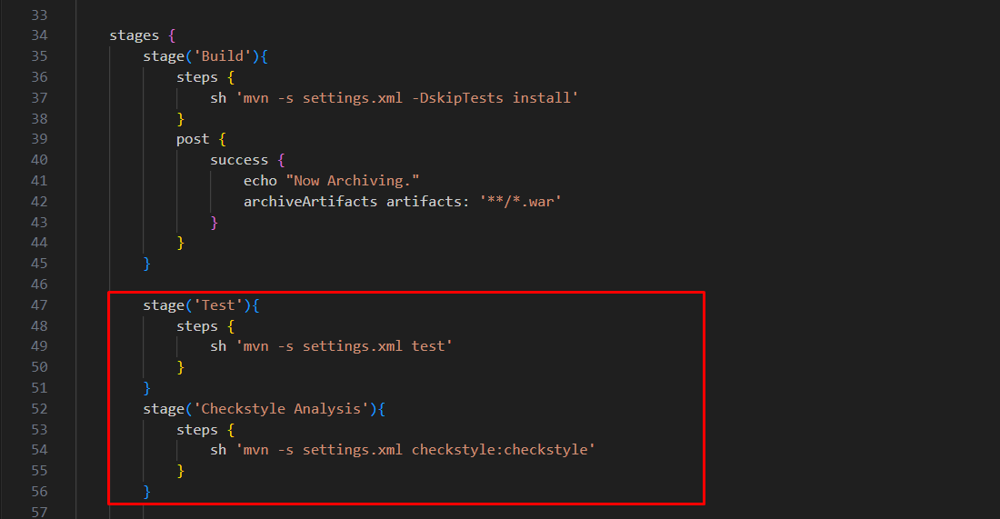
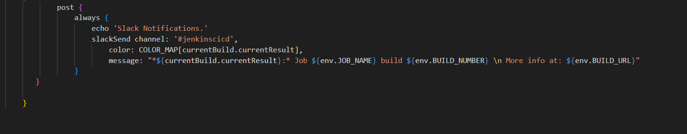
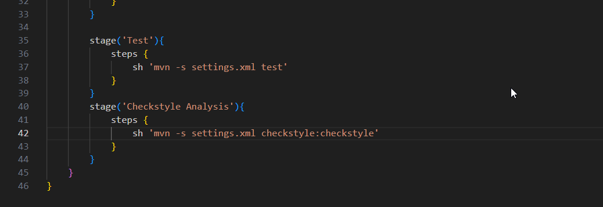
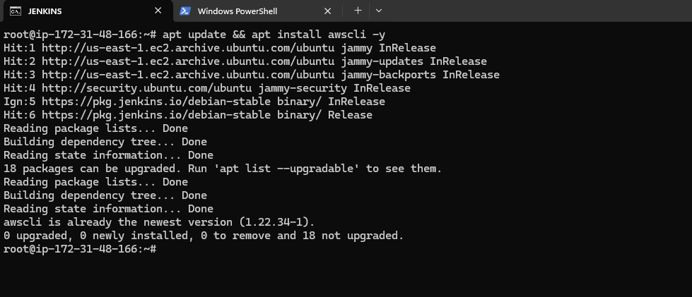
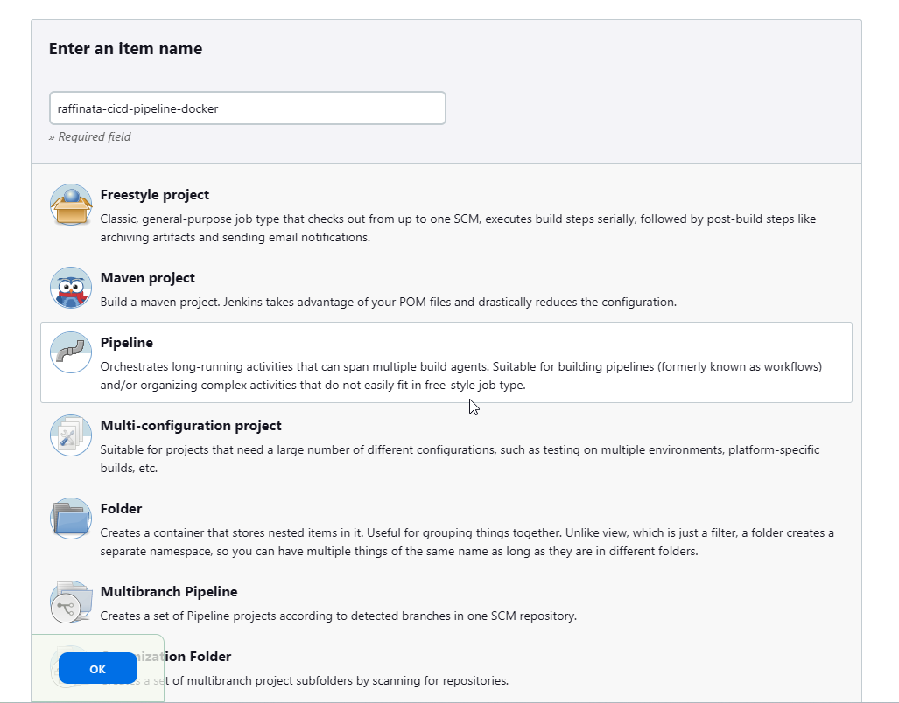
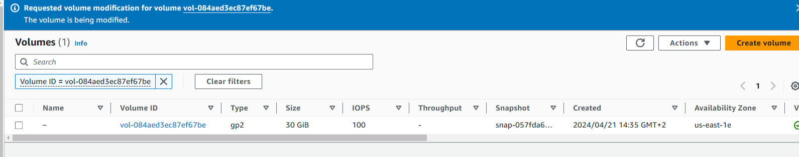

*architecture diagram*

### Scenario

So usually in an enterprise there will be a separate build and release team that will be doing the job of building testing and releasing the code. Developers rely on the build/release team to compile, test, and deploy their code, typically moving it through the release cycle. However, this process can lead to delays in identifying bugs or errors, as testing may not occur frequently. As a result, these issues accumulate over time.

The problem becomes more significant when developers must spend time reworking code to fix these accumulated bugs, especially when approaching deadlines. To address this challenge, product owners need faster testing as code is developed. However, with a manual build and release process, this isn't feasible.

The solution lies in implementing an automated build and release process. With automation, code is built and tested automatically with every commit. Developers receive immediate notifications if there's a build failure or if the code doesn't meet quality standards. This allows them to address issues promptly, preventing further delays in the development process.

By adopting automated processes, developers can focus on writing code while ensuring that it meets quality standards and can be deployed efficiently. This streamlined approach enhances productivity, accelerates delivery, and improves overall software quality.

##

### In this project, we are creating a CI/CD pipeline that will utilize several tools for various stages of the software development lifecycle. 

1. **Continuous Integration with Jenkins**: We'll use Jenkins as our CI server to automate the build and testing process. Jenkins will monitor our source code repository for changes and trigger automated builds whenever new code is pushed. It will compile the code, run tests, and generate build artifacts.

2. **Code Analysis with SonarQube**: As part of the CI process, we'll integrate SonarQube for static code analysis. SonarQube will analyze our code for code smells, bugs, vulnerabilities, and maintainability issues. This ensures that our codebase adheres to best practices and quality standards.

3. **Artifact Repository with Nexus**: We'll use Nexus as our artifact repository to store build artifacts generated by Jenkins. Nexus provides a centralized location to store and manage artifacts.

4. **Containerization with Docker**: We'll containerize our application using Docker to create lightweight, portable, containers. Docker allows us to package our application and its dependencies into a single unit that can run consistently across different environments. 

5. **Docker Image Repository with Amazon ECR**: We'll push our Docker images to Amazon ECR (Elastic Container Registry), a fully managed Docker container registry provided by AWS. ECR securely stores, manages, and deploys Docker images, making it easy to integrate Docker containers into our CI/CD pipeline and deploy them to Amazon ECS.

6. **Deployment with Amazon ECS**: Finally, we'll deploy our containerized application to Amazon ECS (Elastic Container Service), a highly scalable and fully managed container orchestration service provided by AWS. ECS simplifies the deployment and management of Docker containers, allowing us to run and scale our applications with ease. It provides features such as service auto-scaling, health checks, and integration with other AWS services like Elastic Load Balancing for high availability and fault tolerance.

By integrating these tools into our CI/CD pipeline, we can automate the entire software delivery process from code commit to deployment, ensuring rapid and reliable delivery of high-quality software.

## Phase 1: Continous Intergration(CI)

The first phase of this project involves implementing a Continuous Integration (CI) process using Jenkins. Subsequently, we will proceed to Continuous Delivery (CD).

Below is an architectural diagram illustrating our objectives:


First, we'll log in to [github](https://www.github.com) and create a repository. This will serve as our workspace for the project.


After creating the repository, the next step is to clone it to your local machine. I chose to clone it to my desktop, but you can choose any location on your computer.


### CREATE SECURITY GROUPS

To control access to our resources, we will be making use of secury groups. We will create 3 security groups:

- **Jenkins-SG**: **Port 22** is allowed from the user's IP for SSH access, and **Port 8080** is open for Jenkins from any IPv4 address `0.0.0.0/0`.
- **Nexus-SG**: **Port 22** and **Port 8081** are allowed from the user's IP for SSH and web access. Additionally, Nexus is permitted to access Jenkins on **Port 8081**.
- **Sonarqube**: SonarQube allows port 22 from the user's IP and port 80 from the Jenkins Security Group for web access.


If you stop your instances, remember to revisit the security group rules and update them accordingly. Keep in mind that the **public IP will change when an instance is stopped.**

### SERVER/EC2 SETUP WITH USERDATA

We will proceed to launch three EC2 instances and install Jenkins, Nexus, and SonarQube on them. We'll use userdata scripts to automate the installation process. You can find the scripts [here](https://github.com/BusisiwePieterson/jenkins-artifactory-sonarqube/tree/main/userdata)

We are using **Ubuntu Server 22.04** (Free Tier) for Jenkins and Sonarqube and **CentOS 9** for Nexus. Each instance will be associated with its respective security group that we've created.


### POST INSTALLATION

Now that we've installed Jenkins, Nexus, and SonarQube on each server, we need to ensure they are running and accessible via the browser using our public IP address.

Open Git Bash or any command line interface, and SSH to each of the servers. Then switch to the root user by running `sudo -i`, followed by ` systemctl status <tool-name>` to check if the installed tool is running.

Below, we are checking if Jenkins is running using `systemctl status jenkins`, and if Java is installed using `java -version`.

To obtain the password to login to Jenkins, run `cat /var/lib/jenkins/secrets/initialAdminPassword`. After obtaining the password, access Jenkins in your browser using your public IP address and paste the password where prompted.


create a user as an administrator and set a password.


Once logged in to Jenkins, we'll integrate it with various tools such as Nexus, SonarQube, etc. However, Jenkins doesn't inherently recognize these tools, so we need to install plugins to enable interaction with Jenkins.

To install plugins in Jenkins:

- Navigate to "Manage Jenkins" in the Jenkins dashboard.
- Select "Manage Plugins" from the options.
- Go to the "Available" tab to see the list of available plugins.
- Use the search bar to find the plugins you need, such as "Nexus Plugin" and "SonarQube Scanner Plugin".
- Check the checkboxes next to the plugins you want to install.
- Once selected, click on the "Install without restart" button to install the plugins.


Next, check if Nexus is running by executing `systemctl status nexus` in the terminal. 

After confirming that Nexus is running, open Nexus in the browser using your public IP address. You can access Nexus by navigating to `http://<your-public-ip>:8081` in your web browser.


To retrieve the password for Nexus, copy the path `/opt/nexus/sonatype-work/nexus3/admin.password` and paste it into the command line where your Nexus server is running.


Based on the architectural diagram, we'll upload artifacts to Nexus and download dependencies from Nexus. To facilitate this, we'll have multiple repositories, which we'll then combine into a group repository.


We'll create three repositories in Nexus:

1. Maven Hosted: This repository, named "raffinata-relese" will store artifacts we uploads to Nexus.


2. Maven2proxy: Named "raffinata-maven-central" this repository will store dependencies that Maven will download. Nexus will retrieve dependencies from Maven Central if they are not available in this repository.


3. Maven2Group: This repositoy named "raffinata-maven-group" will group all the previously created repositories together.


To create these repositories:

- Navigate to the Nexus dashboard and click on "Repositories."
- Click "Create repository" and select "Maven (Hosted)" for the release repository.
- Provide a name like `<Name-Release>` and configure it accordingly.
Repeat the process for the proxy repository, naming it `<Name-Maven-Central>` and configuring it with the Maven Central URL.
- Finally, create a group repository named `<Wipro-Maven-Group>` and add the previously created repositories to it.

This setup facilitates the storage and retrieval of artifacts and dependencies required for the pipeline.

##
Next, check if SonarQube is running. If it's already running, you can open SonarQube in the browser using your public IP address.


The default username for SonarQube is `admin`, and the default password is also `admin`.


## Build Job with Nexus Repo

Now it's time to write our Jenkins pipeline. We'll create a pipeline that builds an artifact from our source code. For building the artifact, we'll use Maven, which requires the JDK as a dependency. 

To add tools in Jenkins, navigate to "Manage Jenkins" and select "Tools." From here, you can add tools that will be used in the pipeline.

When adding tools, such as Maven, you'll see options based on the plugins installed in Jenkins. For example, if you have the Git, Gradle, Maven, and JDK plugins installed, you'll see corresponding options.

In your Jenkins server, execute the command `ls /usr/lib/jvm` to view the versions of Java installed on the system. This command will display the available Java installations along with their respective directories.


### 
For JDK, select "Add" and provide a name, such as "Oracle JDK 11." Uncheck the option to install automatically, as it may cause issues. Instead, directly install JDK 11 and 8 in Jenkins and specify its path which is `/usr/lib/jvm/<java-directory>`

By adding these tools, you can reference them in your pipeline scripts, ensuring the correct versions are used.


Now, in our pipeline code, Maven will download dependencies from Nexus. To authenticate with Nexus from Maven, we need to add Nexus credentials in Jenkins, which we'll then reference in the pipeline.

To do this:

Go to *"Credentials"* in Jenkins >
Click on *"System"* and then > *"Global credentials"* >
Click on *"Add credentials"*.


### Time to write the Pipeline in a Jenkinsfile

Open the GitHub repository that you cloned earlier and create a file named `Jenkinsfile`. This file will contain the declarative or scripted pipeline script that defines the steps of your CI/CD process.


In the Jenkinsfile, we'll define a stage for the build process. Within this stage, we'll have steps, which will include a Maven command. Here's an overview of the Maven command:

```
mvn '-s settings.xml -DskipTests install'

```

Explanation of the command:

- `mvn`: This is the Maven command.
- `-s settings.xml`: This specifies the settings file to be used by Maven. We'll define settings in a settings.xml file.
- `-DskipTests`: This parameter tells Maven to skip running tests during the build.
- `install`: This command instructs Maven to build and install the project into the local repository, skipping tests.


Just before the stages section in the `Jenkinsfile`, add an `environment` block where you'll define all the variables used in the `settings.xml` and `pom.xml` files. This will ensure that these variables are accessible throughout the pipeline.


Next, commit your code to Github


Let's head back to Jenkins to create the job. Here's what we'll do:

- Navigate to Jenkins.
- Click on "New Item" to create a new job.
- Give the job a name, such as "profile-ci-pipeline".
- Select the "Pipeline" option.
- Click "OK" to create the job.


Next, let's add credentials for authentication with GitHub. Jenkins requires the GitHub SSH private key for authentication. You can generate this SSH key pair following instructions from the video [here](https://www.youtube.com/watch?v=X40b9x9BFGo). Once you've generated the SSH key pair, copy the private key. We'll use it to configure Jenkins for authentication with GitHub.


In the pipeline configuration, select "Pipeline script from SCM".
Choose "Git" as the SCM.
Enter the repository URL of your GitHub repository.

Next, under the "Credentials" section in Jenkins, select "Add". Then, under "Kind", choose "SSH username with private key". Click on "Private key" and select "Enter directly". Finally, paste your private key into the provided field. This will configure Jenkins to use the SSH private key for authentication with GitHub.


To resolve the error, switch to the root user using `sudo -i`, then switch to the Jenkins user using `su - jenkins`. Next, Jenkins user should run the SSH command, replacing the URL with your GitHub account. After entering the command, press enter and type "yes" when prompted. This action stores GitHub's identity within the Jenkins user.


Under "Branches to build", remove `/master` and enter `/main`, as this is the branch we are currently using.


Start the build process and keep an eye on the loading bar to monitor progress. Notice that dependencies are being downloaded from Nexus, which in turn retrieves them from the Maven repository. Once the process completes, you'll see that the build has finished successfully. If the build fails, double-check your variable names.


### GITHUB WEBHOOK

Whenever you make a commit, the pipeline should trigger automatically. We will now create a Webhook t achieve this.


Next we go back to Jenkins, navigate to your Jenkins job, then click on "Configure". Enable the option "GitHub hook trigger for GIT SCM polling" by checking the box. Finally, save your changes.


Return to the Jenkinsfile and add a post-installation step to the Build stage. Utilize the `archiveArtifacts` plugin, which is already installed. This step should archive anything that ends with `.war`, as this is the extension of our artifact.


The next stages we'll add are "Test" for our unit tests and "Checkstyle Analysis" to check for any issues with our code. We Commit the code and initiate a build.




### Code Analysis with SonarQube

In our pipeline, we have several stages: **build**, **test**, and **Checkstyle analysis**. The build stage creates the artifact, the test stage runs unit tests and generates reports, and the Checkstyle analysis stage checks for code issues and generates reports. 

To view these reports, we navigate to the workspace of the Jenkins job and find the checkstyle result and reports. These reports aren't human-readable, so we'll use SonarQube server to present the results in a human readable format.

##

First we will set up the `SonarScanner Tool` then store the SonarQube server information in Jenkins. Scroll down to the Sonar section and click "Add SonarQube." Check the box and name it "sonarserver" or any name you choose then enter the SonarQube URL as `<http://private-IP-of-SonarQube-server>`


Next, let's add our SonarQube credentials. However, for Jenkins to communicate with SonarQube, we need to create a token for SonarQube and add that token in Jenkins. This token acts as a form of authentication between Jenkins and SonarQube.


Once you've generated the token, you can add it to Jenkins as part of the SonarQube credentials.


To help identify code quality issues, bugs, and vulnerabilities, we will now create the "Sonar Analysis" job. Commit the code and build the job again.


You'll notice that the job passes the quality gate. SonarQube has its own default quality gate, which is why it passed despite the existence of bugs and vulnerabilities in the code.


Because we do not want to use the default quality gate, we will create our own quality gate with our own rules. We give our quality gate a name.


Below, you can see that we set the condition: if there are more than 25 bugs, then we want our quality gate to fail.


Just as GitHub sends a webhooks to Jenkins, we need a webhook for SonarQube. Jenkins needs a SonarQube webhook to receive notifications from SonarQube regarding the analysis results of the code.


We will now add one more stage to our pipeline. Just after the analysis stage, we have the "Quality Gate" stage. Set a timeout of one hour for this stage. If SonarQube does not respond within this time, the pipeline will abort. Save and commit the changes to your Jenkinsfile, then initiate the build.


When you initiate the build, you will notice that it fails due to the quality gate failure. This indicates that our quality gate is functioning correctly. Recall that we configured the condition that if there are more than 25 bugs, the quality gate should fail.


Go back to your quality gate and change the condition to 100. Then initiate the build again. Now you will observe that the build passes because the quality gate has passed.


### Publish to Nexus

In our pipeline code, we archive the artifact for upload to a repository. Once archived, you'll see the last successful artifact. You can also find it in the workspace. To upload it to the Nexus repository, we need to rename it with a timestamp. Each time we upload a new artifact it will have a different version number. 

For this, we installed the Build Timestamp plugin. Set its value in "Manage Jenkins" > "Configure System."


We need to upload the artifacts to Nexus. Search for the plugin on Google, take the code, paste it in the Jenkinsfile, and modify it to suit your needs.


Now initiate the build again, you will see the Nexus url repository, when you go to Nexus you will be able to see the artifact with the timestamp.


You can use the link to download the artifact if you need it.


### Slack for Notifications

At the moment, we are manually checking Jenkins to know whether the build has passed or failed. However, we can set up a notification system so we don't even need to check Jenkins for the build status. Instead, we'll receive notifications indicating whether the build has passed or failed. Based on the result, we can take the next action or step accordingly. In this project we will be using Slack for notifications.

Go to the Slack website (https://slack.com/get-started) to create a Slack workspace. Use the pictures below as a guide.


Jenkins will need this token to intergrate with Slack


Create Slack credentials and add the token there.


To test the connection between Jenkins and Slack, you can initiate a test notification from Jenkins to Slack. This will confirm whether the integration is working correctly.


At the top of the pipeline, we define a color map. If the argument parsed is "success," it returns "good." In Jenkins, "good" corresponds to the color green, while "danger" represents red. We dynamically parse these color codes in Slack based on whether the build succeeded or failed. If the current result is success, we send the "good" color code; otherwise, we send "danger."


With Slack setup we need to add a post stage in our Jenkinsfile, we will write that at the bottom of the pipeline.



To test this, we run our pipeline again. You'll see the status of the pipeline on Slack, meaning Slack has sent a notification.


## Phase 2: Continous Delivery(CD)

Now that we have our artifacts, it it time for us to deploy our application.Ensure that the pipeline works because we'll be extending it from continuous integration to continuous delivery. Below is an architectural diagram of what we are trying to achieve.


##


First we log in to our AWS console and create an IAM user, then create an ECR repository. The IAM user will have permissions for `AmazonEC2ContainerRegistryFullAccess` and `AmazonECS_FullAccess`


Next, we create a Docker repository, we will use Amazon's Elastic Container Registry to store our docker image.


Next let's install the necessary plugins


After installing the plugins we need to store the AWS credentials in Jenkins.

Go to Jenkins global credentials and click on "Add Credentials." In the "Kind" dropdown, you should see "AWS Credentials" since the plugin was installed. Select that and give it a name, for example, "creds." In the "ID" and "Description," you can use the same name. Then, enter the access key and secret key. Once you have entered the keys, click "OK" to save the credentials


Next we need to to install the Docker engine on the Jenkins server.SSH into your Jenkins server. 

First switch to root user `sudo -i` then run `apt update && apt install awscli -y`


Next, go to Google and search for "Docker installation," then follow the instructions for installing Docker on your specific operating system.














KKKKKKKKKKKKKKKKK


