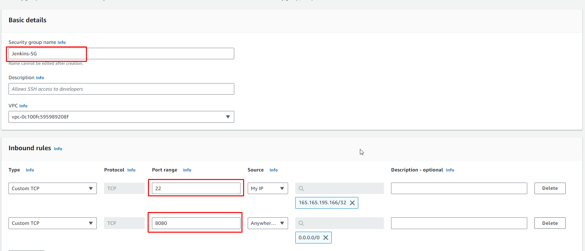

# jenkins-artifactory-sonarqube

 CREATE SECURITY GROUPS

LAUNCH INSTNACE AND USE SCRIPT FOR USER-DATA

MAVEN, CLICK ON REPOSITORY--> CREATE REPOSITORY

second repo is to store the dependancies, our Maven Tool in Jenkins will download tools fro this reposistory
