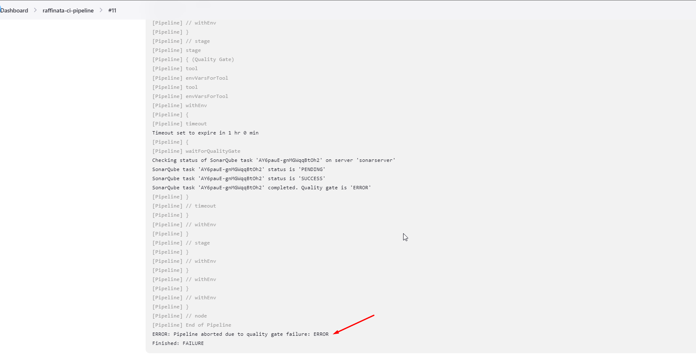
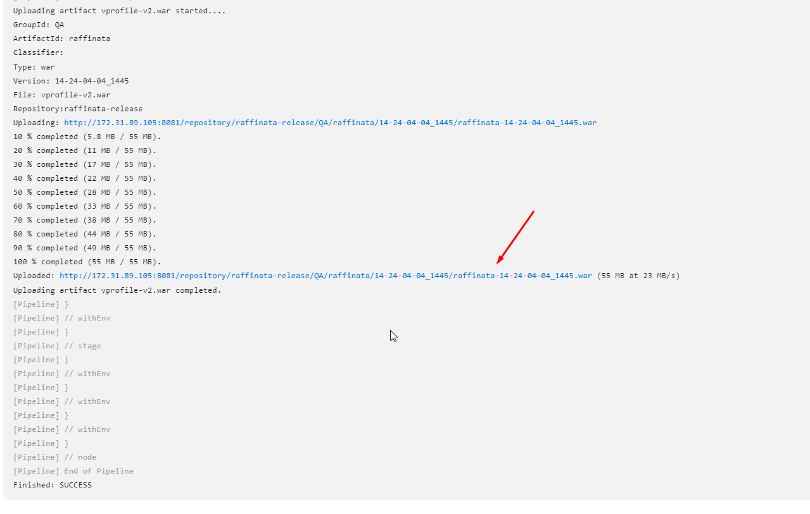
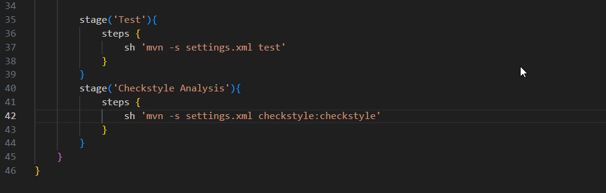
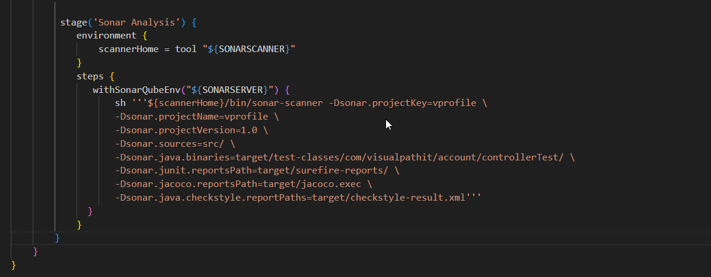
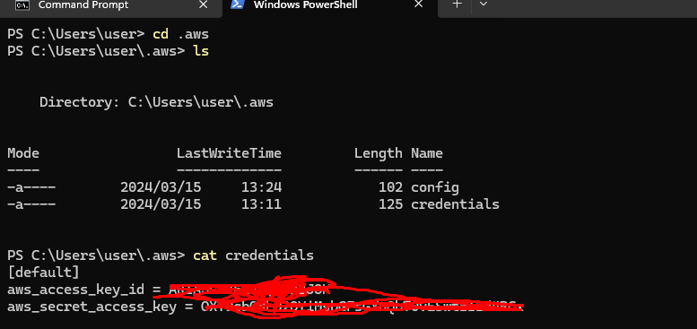
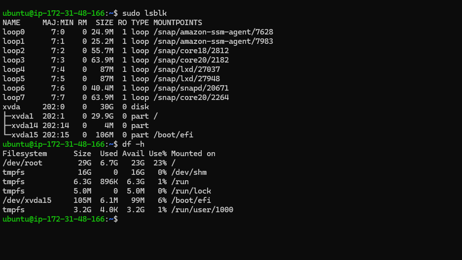
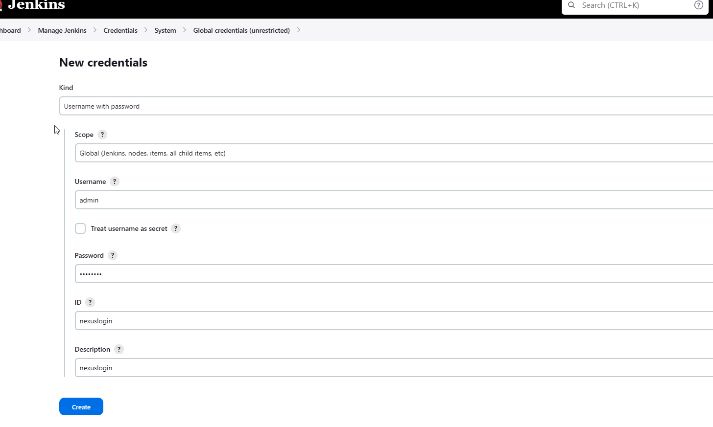

# jenkins-artifactory-sonarqube

 CREATE SECURITY GROUPS

LAUNCH INSTNACE AND USE SCRIPT FOR USER-DATA

## Build Job with Nexus Repo

MAVEN, CLICK ON REPOSITORY--> CREATE REPOSITORY

We are going to write an artifact that will build a pipeline from our source code, to build the artifact we use a maven commands.

second repo is to store the dependancies, our Maven Tool in Jenkins will download tools fro this reposistory

## GITHUB WEBHOOK

